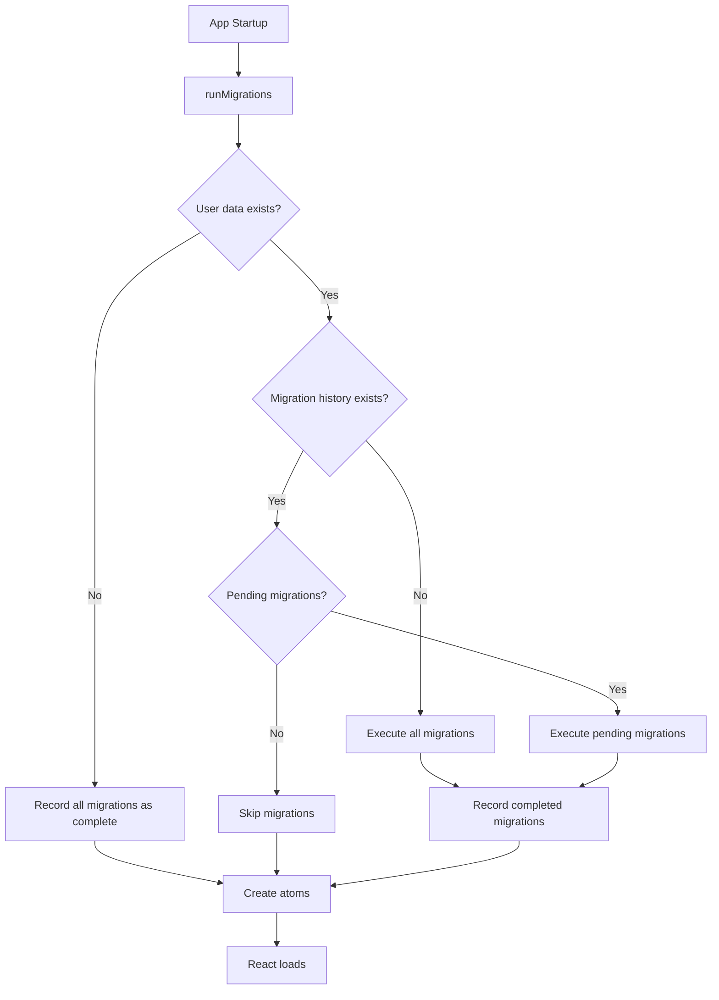

# Design Document: LocalForage Migration System

## Overview

The LocalForage Migration System provides a mechanism to transform persisted
user data when data structures change between Graph Explorer versions. It
integrates with the existing `atomWithLocalForage` pattern and executes before
React loads to ensure atoms always receive correctly structured data.

The system follows a simple model:

1. Check if any user data exists in LocalForage
2. Check the migration history to determine which migrations have run
3. Execute any pending migrations in order
4. Record completed migrations in the history
5. Allow normal atom initialization to proceed

## Architecture



The migration system runs as part of the async atom initialization in
`storageAtoms.ts`. It executes before any atoms are created, ensuring data is in
the correct format when atoms read from LocalForage.

## Components and Interfaces

### Migration Interface

```typescript
/** Options for defining a migration, following TanStack Query patterns */
interface MigrationOptions {
  /** Unique key identifying this migration */
  migrationKey: string;
  /** Async function that performs the data transformation */
  migrationFn: (context: MigrationContext) => Promise<void>;
}

/** Helper function to create type-safe migration options */
function migrationOptions(options: MigrationOptions): MigrationOptions {
  return options;
}

/** Context provided to migration functions */
interface MigrationContext {
  /** Read a value from LocalForage */
  get: <T>(key: string) => Promise<T | null>;
  /** Write a value to LocalForage */
  set: <T>(key: string, value: T) => Promise<void>;
  /** Remove a value from LocalForage */
  remove: (key: string) => Promise<void>;
}
```

Usage example:

```typescript
const renameMigration = migrationOptions({
  migrationKey: "rename-config-key",
  migrationFn: async ctx => {
    const old = await ctx.get("old-key");
    if (old) {
      await ctx.set("new-key", old);
      await ctx.remove("old-key");
    }
  },
});
```

### Migration Registry

```typescript
/** Ordered array of migrations - position determines execution order */
const migrations: MigrationOptions[] = [
  // Migrations are added here as needed
  // Example:
  // migrationOptions({
  //   migrationKey: "rename-config-key",
  //   migrationFn: async (ctx) => {
  //     const old = await ctx.get("old-key");
  //     if (old) {
  //       await ctx.set("new-key", old);
  //       await ctx.remove("old-key");
  //     }
  //   },
  // }),
];
```

### Migration History

```typescript
/** Record of completed migrations stored in LocalForage */
interface MigrationHistory {
  /** Set of migration IDs that have been executed */
  completedMigrations: Set<string>;
}

/** LocalForage key for migration history */
const MIGRATION_HISTORY_KEY = "migration-history";
```

### Core Functions

```typescript
/**
 * Runs all pending migrations before atom initialization.
 * Called once at app startup before atoms are created.
 */
async function runMigrations(): Promise<void>;

/**
 * Checks if any user data exists in LocalForage.
 * Used to determine if this is a fresh installation.
 */
async function hasUserData(): Promise<boolean>;

/**
 * Gets the current migration history from LocalForage.
 * Returns null if no history exists (legacy data).
 */
async function getMigrationHistory(): Promise<MigrationHistory | null>;

/**
 * Records a migration as completed in the history.
 */
async function recordMigration(migrationKey: string): Promise<void>;

/**
 * Gets the list of migrations that need to be executed.
 */
function getPendingMigrations(
  history: MigrationHistory | null,
): MigrationOptions[];
```

## Data Models

### Storage Keys

The migration system uses a dedicated key for its history:

| Key                 | Type             | Description                    |
| ------------------- | ---------------- | ------------------------------ |
| `migration-history` | MigrationHistory | Record of completed migrations |

Existing user data keys that migrations may interact with:

| Key                                    | Type                                           |
| -------------------------------------- | ---------------------------------------------- |
| `active-configuration`                 | ConfigurationId \| null                        |
| `configuration`                        | Map<ConfigurationId, RawConfiguration>         |
| `schema`                               | Map<string, SchemaStorageModel>                |
| `user-styling`                         | UserStyling                                    |
| `user-layout`                          | UserLayout                                     |
| `graph-sessions`                       | Map<ConfigurationId, GraphSessionStorageModel> |
| `showDebugActions`                     | boolean                                        |
| `allowLoggingDbQuery`                  | boolean                                        |
| `defaultNeighborExpansionLimitEnabled` | boolean                                        |
| `defaultNeighborExpansionLimit`        | number                                         |

### Migration History Structure

```typescript
// Stored in LocalForage under "migration-history"
{
  completedMigrations: Set<string>; // e.g., Set(["rename-config", "add-field"])
}
```

The `completedMigrations` set contains the `migrationKey` values of migrations
that have been executed.

### Detection of User Data

To determine if user data exists (for fresh installation detection), the system
uses `localForage.keys()` to get all stored keys and checks if any key exists
other than the migration history key:

```typescript
async function hasUserData(): Promise<boolean> {
  const keys = await localForage.keys();
  return keys.some(key => key !== MIGRATION_HISTORY_KEY);
}
```

This approach is simple and automatically handles any future storage keys
without needing to maintain a list of known keys.

## Correctness Properties

_A property is a characteristic or behavior that should hold true across all
valid executions of a system—essentially, a formal statement about what the
system should do. Properties serve as the bridge between human-readable
specifications and machine-verifiable correctness guarantees._

### Property 1: Migration History Round-Trip

_For any_ migration history object, serializing it to LocalForage and then
reading it back should produce an equivalent object.

**Validates: Requirements 1.4**

### Property 2: Successful Migration Recording

_For any_ migration that executes without throwing an error, the migration's
identifier should be present in the migration history after execution completes.

**Validates: Requirements 1.2**

### Property 3: Failed Migration Not Recorded

_For any_ migration that throws an error during execution, the migration's
identifier should NOT be present in the migration history.

**Validates: Requirements 7.1**

### Property 4: Fresh Installation Behavior

_For any_ set of registered migrations, when no user data exists in LocalForage,
running migrations should mark all migrations as complete without executing any
migration functions.

**Validates: Requirements 2.1**

### Property 5: Legacy Data Full Migration

_For any_ set of registered migrations, when user data exists but no migration
history exists, all migrations should execute in registry order.

**Validates: Requirements 3.2**

### Property 6: Partial History Pending Execution

_For any_ set of registered migrations and any migration history containing a
subset of migration IDs, running migrations should execute only the migrations
not in the history, in registry order.

**Validates: Requirements 1.3, 4.1, 4.2**

### Property 7: Data Preservation

_For any_ LocalForage key not modified by a migration, the value at that key
should remain unchanged after the migration executes.

**Validates: Requirements 3.3**

### Property 8: Migration Context Operations

_For any_ key and value, the MigrationContext should correctly support get, set,
and remove operations such that: setting a value then getting it returns the
same value, and removing a key then getting it returns null.

**Validates: Requirements 5.1, 5.2, 5.3, 5.4**

### Property 9: Duplicate Migration Key Rejection

_For any_ migration registry, if two migrations have the same `migrationKey`,
the system should detect and report the duplicate.

**Validates: Requirements 9.5**

## Error Handling

### Migration Execution Errors

When a migration throws an error:

1. The error is logged with the migration ID and error details
2. The migration is NOT recorded as completed
3. Subsequent migrations in the registry are NOT executed
4. The error propagates up to prevent app initialization
5. The app displays an error page indicating migration failure

This fail-fast approach ensures data integrity—the app cannot start with data in
an inconsistent state. Users will see a clear error message rather than
experiencing undefined behavior from partially migrated data.

```typescript
async function executeMigration(
  migration: MigrationOptions,
  ctx: MigrationContext,
) {
  try {
    logger.debug(`Running migration: ${migration.migrationKey}`);
    await migration.migrationFn(ctx);
    await recordMigration(migration.migrationKey);
    logger.debug(`Completed migration: ${migration.migrationKey}`);
  } catch (error) {
    logger.error(`Migration failed: ${migration.migrationKey}`, error);
    throw error; // Propagate to halt app initialization
  }
}
```

### App Initialization Error Handling

The migration system is called from `storageAtoms.ts` which uses top-level
await. If migrations fail, the module fails to load, which prevents React from
rendering. The app's error boundary or a dedicated migration error handler
should catch this and display an appropriate error page.

```typescript
// In storageAtoms.ts
try {
  await runMigrations();
} catch (error) {
  // Store error for display, then re-throw to halt initialization
  migrationError = error;
  throw error;
}
```

### LocalForage Errors

LocalForage operations may fail due to:

- IndexedDB quota exceeded
- Browser in private mode with restricted storage
- Corrupted IndexedDB state

These errors propagate up and halt initialization. The app should display an
error state rather than proceeding with potentially corrupted data.

### Duplicate Migration Key Detection

At module load time, the migration registry is validated for duplicate keys:

```typescript
function validateMigrations(migrations: MigrationOptions[]): void {
  const keys = new Set<string>();
  for (const migration of migrations) {
    if (keys.has(migration.migrationKey)) {
      throw new Error(`Duplicate migration key: ${migration.migrationKey}`);
    }
    keys.add(migration.migrationKey);
  }
}
```

## Testing Strategy

### Testing Approach

The migration system uses comprehensive unit tests with Vitest. The correctness
properties identified in this design guide the test cases, but are implemented
as standard unit tests with multiple representative examples rather than
property-based tests.

This approach:

- Avoids adding new dependencies
- Keeps tests simple and readable
- Provides sufficient coverage for the migration logic

### Test Organization

Tests are co-located with source files following project conventions:

```
src/core/StateProvider/
├── migrations/
│   ├── index.ts           # Main migration runner
│   ├── index.test.ts      # Unit tests
│   ├── types.ts           # Migration interfaces
│   └── registry.ts        # Migration definitions
```

### Test Cases by Property

Each correctness property maps to one or more unit tests:

| Property | Test Cases                                                |
| -------- | --------------------------------------------------------- |
| 1        | History saved and loaded correctly with various data      |
| 2        | Successful migration ID appears in history                |
| 3        | Failed migration ID does not appear in history            |
| 4        | Empty storage marks all migrations complete, none execute |
| 5        | Data without history runs all migrations in order         |
| 6        | Partial history runs only missing migrations in order     |
| 7        | Keys not touched by migration remain unchanged            |
| 8        | Context get/set/remove work as expected                   |
| 9        | Duplicate migration keys throw error                      |

### Unit Test Cases

```typescript
describe("runMigrations", () => {
  // Property 1: Round-trip
  test("should persist and load migration history correctly");
  test("should handle empty history");
  test("should handle history with multiple migrations");

  // Property 2: Recording on success
  test("should record migration ID after successful execution");

  // Property 3: Not recording on failure
  test("should not record migration ID when migration throws");
  test("should stop executing subsequent migrations on failure");

  // Property 4: Fresh installation
  test("should mark all migrations complete when no user data exists");
  test("should not execute any migrations when no user data exists");

  // Property 5: Legacy data
  test("should execute all migrations when data exists but no history");
  test("should execute migrations in registry order");

  // Property 6: Partial history
  test("should execute only pending migrations");
  test("should skip already-completed migrations");
  test("should execute pending migrations in order");
  test("should do nothing when all migrations are complete");

  // Property 7: Data preservation
  test("should not modify keys untouched by migration");

  // Property 8: Context operations
  test("context.get should return stored value");
  test("context.get should return null for missing key");
  test("context.set should store value");
  test("context.remove should delete key");

  // Property 9: Duplicate detection
  test("should throw error for duplicate migration keys");
});
```

### Mocking Strategy

Tests use `localforage-driver-memory` as an in-memory driver for LocalForage:

- Provides real LocalForage behavior without IndexedDB
- Allows tests to run in Node.js environment
- Supports all LocalForage operations (get, set, remove, keys, clear)
- Isolates tests from browser storage

Setup in tests:

```typescript
import localforage from "localforage";
import memoryDriver from "localforage-driver-memory";

beforeAll(async () => {
  await localforage.defineDriver(memoryDriver);
  await localforage.setDriver(memoryDriver._driver);
});

beforeEach(async () => {
  await localforage.clear();
});
```

This approach replaces the current Map-based mock in `setupTests.ts` with a more
realistic in-memory implementation.

## Developer Guide: Adding Migrations

This section provides step-by-step instructions for developers who need to add
new migrations when data structures change.

### When to Add a Migration

Add a migration when:

- Renaming a LocalForage storage key
- Changing the structure of stored data (adding/removing/renaming fields)
- Splitting or merging stored data across keys
- Changing data types of stored values
- Removing deprecated storage keys

Do NOT add a migration when:

- Adding a new storage key with a new atom (atoms handle defaults)
- The change is backward compatible (old data still works)

### Step-by-Step: Adding a New Migration

#### 1. Create the Migration

Add your migration to the registry in
`src/core/StateProvider/migrations/registry.ts`:

```typescript
import { migrationOptions } from "./types";

export const migrations = [
  // ... existing migrations

  // Add new migrations at the END of the array
  migrationOptions({
    migrationKey: "descriptive-migration-name",
    migrationFn: async ctx => {
      // Your migration logic here
    },
  }),
];
```

#### 2. Choose a Good Migration Key

- Use kebab-case: `rename-user-config`, `add-schema-version`
- Be descriptive: the key should indicate what the migration does
- Keys must be unique across all migrations
- Keys are permanent—never change them after release

#### 3. Write the Migration Function

The `migrationFn` receives a `MigrationContext` with these methods:

```typescript
migrationFn: async ctx => {
  // Read existing data
  const oldData = await ctx.get<OldType>("old-key");

  // Check if migration is needed
  if (!oldData) {
    return; // Nothing to migrate
  }

  // Transform the data
  const newData = transformData(oldData);

  // Write the new data
  await ctx.set("new-key", newData);

  // Optionally remove old data
  await ctx.remove("old-key");
};
```

#### 4. Handle Edge Cases

Always handle these scenarios:

```typescript
migrationFn: async ctx => {
  const data = await ctx.get<MyType>("my-key");

  // Handle missing data
  if (!data) {
    return;
  }

  // Handle already-migrated data (idempotency)
  if ("newField" in data) {
    return;
  }

  // Perform migration
  const migrated = { ...data, newField: "default" };
  await ctx.set("my-key", migrated);
};
```

#### 5. Write Tests

Add tests for your migration in
`src/core/StateProvider/migrations/index.test.ts`:

```typescript
describe("descriptive-migration-name migration", () => {
  test("should transform old data to new format", async () => {
    // Setup: old data format
    await localforage.setItem("old-key", { oldField: "value" });

    // Run migrations
    await runMigrations();

    // Verify: new data format
    const result = await localforage.getItem("new-key");
    expect(result).toEqual({ newField: "value" });

    // Verify: old key removed (if applicable)
    expect(await localforage.getItem("old-key")).toBeNull();
  });

  test("should handle missing data gracefully", async () => {
    // Setup: no old data, but some other data exists
    await localforage.setItem("other-key", "value");

    // Run migrations - should not throw
    await runMigrations();
  });

  test("should be idempotent", async () => {
    // Setup: already migrated data
    await localforage.setItem("new-key", { newField: "value" });

    // Run migrations twice
    await runMigrations();
    await runMigrations();

    // Verify: data unchanged
    const result = await localforage.getItem("new-key");
    expect(result).toEqual({ newField: "value" });
  });
});
```

### Common Migration Patterns

#### Renaming a Key

```typescript
migrationOptions({
  migrationKey: "rename-config-to-settings",
  migrationFn: async ctx => {
    const data = await ctx.get("config");
    if (data) {
      await ctx.set("settings", data);
      await ctx.remove("config");
    }
  },
});
```

#### Adding a Field with Default

```typescript
migrationOptions({
  migrationKey: "add-theme-preference",
  migrationFn: async ctx => {
    const settings = await ctx.get<Settings>("settings");
    if (settings && !("theme" in settings)) {
      await ctx.set("settings", { ...settings, theme: "light" });
    }
  },
});
```

#### Transforming Data Structure

```typescript
migrationOptions({
  migrationKey: "flatten-nested-config",
  migrationFn: async ctx => {
    const config = await ctx.get<OldConfig>("config");
    if (config?.nested) {
      const flattened: NewConfig = {
        field1: config.nested.field1,
        field2: config.nested.field2,
      };
      await ctx.set("config", flattened);
    }
  },
});
```

#### Migrating Map Data

```typescript
migrationOptions({
  migrationKey: "update-schema-format",
  migrationFn: async ctx => {
    const schemas = await ctx.get<Map<string, OldSchema>>("schema");
    if (!schemas) return;

    const updated = new Map<string, NewSchema>();
    for (const [key, oldSchema] of schemas) {
      updated.set(key, transformSchema(oldSchema));
    }
    await ctx.set("schema", updated);
  },
});
```

### Best Practices

1. **Never modify existing migrations** - Once released, migrations are
   immutable. Users may have already run them.

2. **Always add to the end** - New migrations go at the end of the array.
   Position determines execution order.

3. **Make migrations idempotent** - Running a migration twice should produce the
   same result as running it once.

4. **Handle missing data** - Always check if data exists before transforming.

5. **Test thoroughly** - Test with old data, missing data, and already-migrated
   data.

6. **Keep migrations focused** - One migration should do one thing. Split
   complex changes into multiple migrations.

7. **Log important operations** - Use `logger.debug()` for visibility into what
   migrations are doing.

## Steering Documentation

The implementation should include updates to the project's steering
documentation (`.kiro/steering/`) to help developers understand when and how to
add migrations. This includes:

1. **Adding a migrations section** to the relevant steering file explaining:
   - When migrations are needed
   - How to add a new migration
   - Testing requirements for migrations

2. **Updating AGENTS.md** (if appropriate) with:
   - Reference to migration documentation
   - Key patterns for migration code
